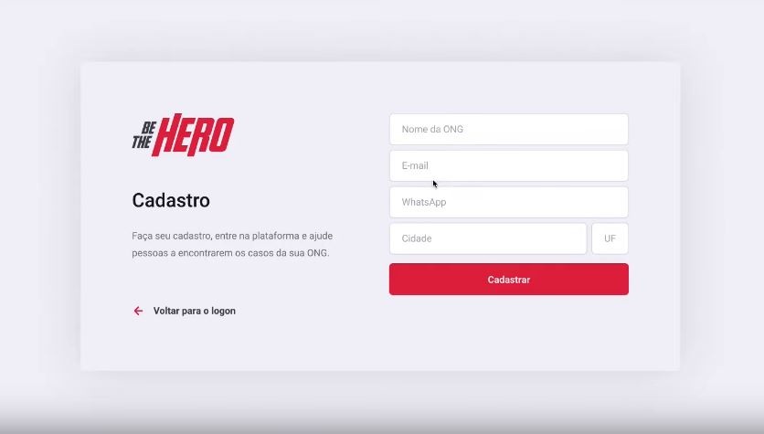
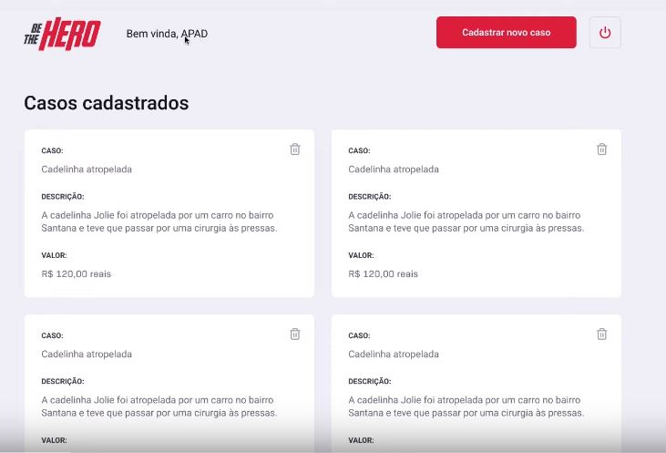
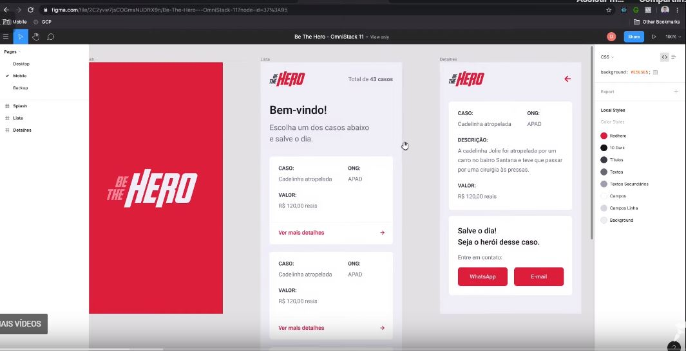
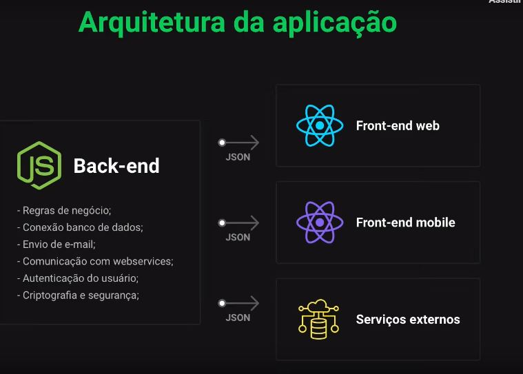
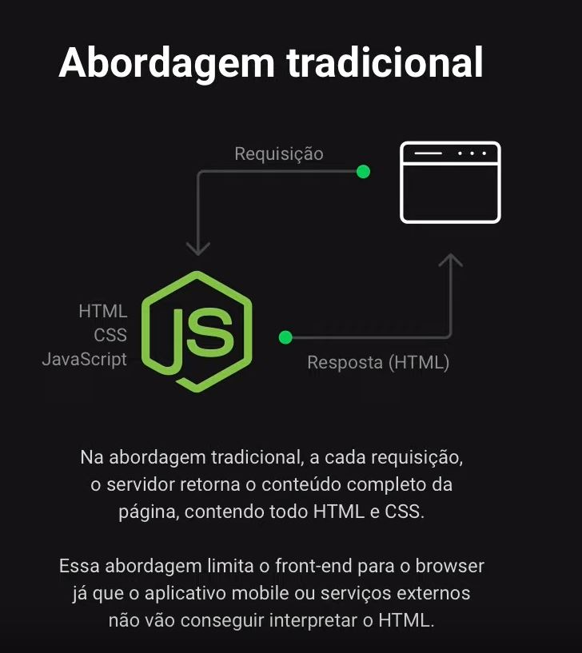
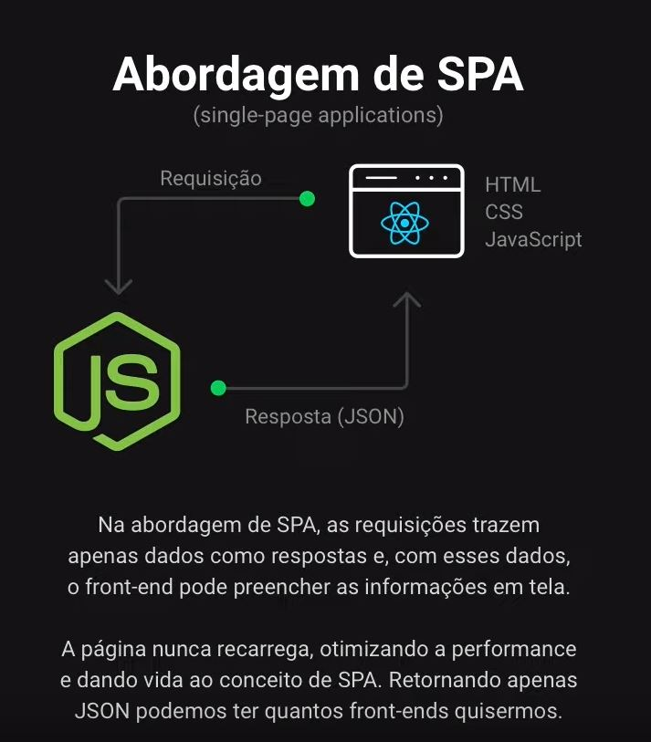
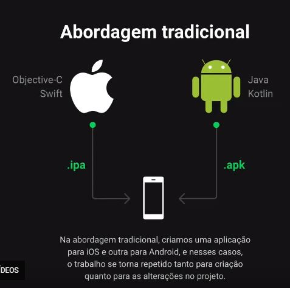
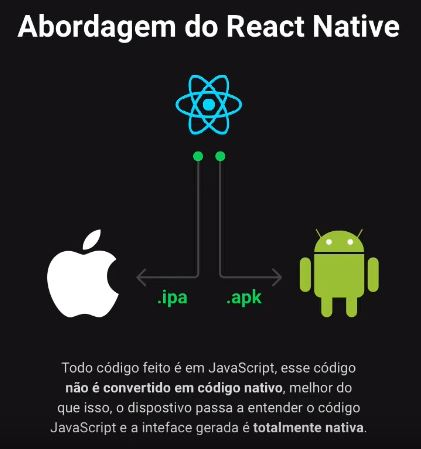
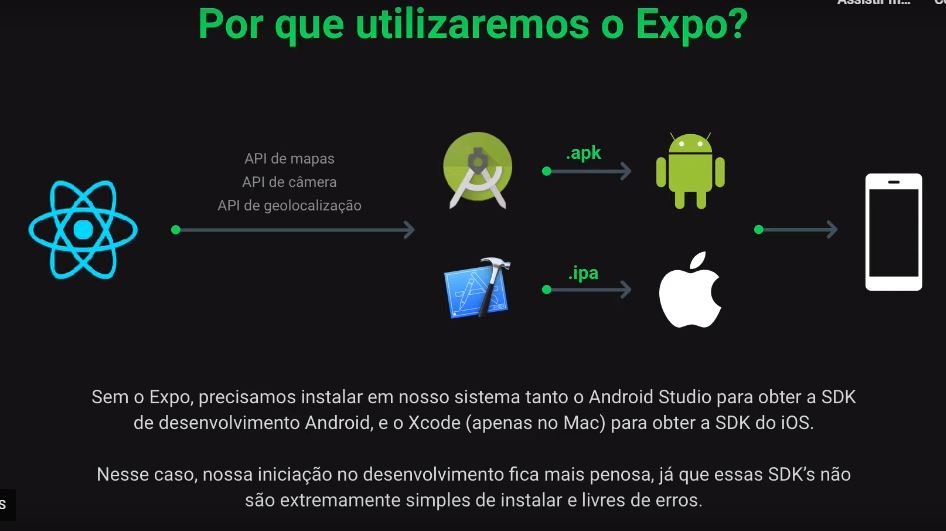
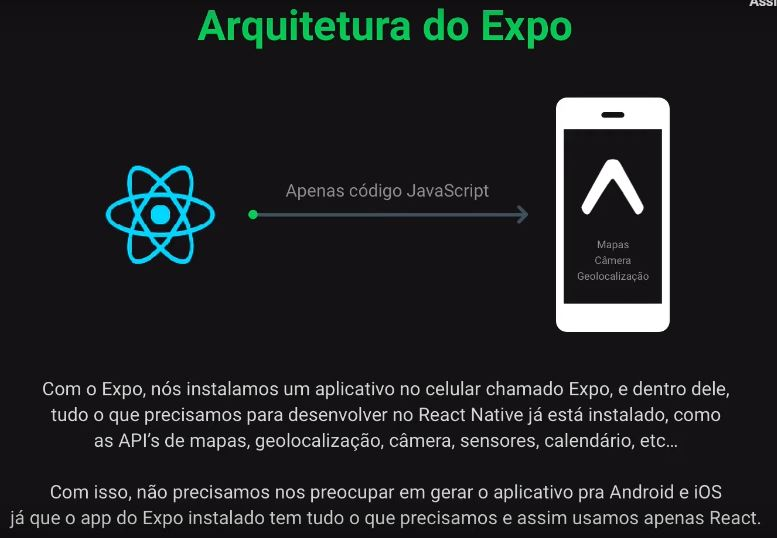

# Rocketseat OmniStack 11

https://rocketseat.com.br/week/aulas/11.0


## <a name="indice">Índice</a>

1. [23/03 - Conhecendo a OmniStack](#parte1)     
2. [24/03 - Criando a base da aplicação](#parte2)     
3. [25/03- Construindo a interface web](#parte3)     
4. [26/03 - Desenvolvendo o app mobile](#parte4)     
5. [27/03 - Funcionalidades avançadas](#parte5)     
---


## <a name="parte1">1 - 23/03 - Conhecendo a OmniStack</a>

- Link da Aula: https://youtu.be/Hfe28D4cFQA

- Apresentar a Aplicação:









- Configurar ambiente de desenvolvimento
  - Node & NPM
    - https://nodejs.org/
    - https://www.npmjs.com/
  - Visual Studio Code
- Entender sobre o Back-end & Front-End



- Criar projeto com Node.js
```
npm init -y

npm install express

node index.js
```

```js
const express = require('express');

const app = express();

app.get('/', (request, response)=> {
    //response.send("Olá Mundo!!");
    response.json({
        evento: "OmniStak 11",
        aluno: "José Malcher Jr."
    })
});

app.listen(3333);

```

- Entender sobre REACT & SPA





- Criar projeto com ReactJS

```
npx create-react-app frontend

npm start
```

- Entender Sobre React Native & EXPO










[Voltar ao Índice](#indice)

---


## <a name="parte2">2 - 24/03 - Criando a base da aplicação</a>

- Node.js & Express
  - Rotas e recursos
  - Métodos HTTP
  - Tipos de Parâmetros
- Utilizando o Insomnia

```
/*
*   Rota / Recuso
*   app.get('/users', (request, response)=> {});
*/

/*
* Método HTTP
*
* GET: Buscauma informação do Back-end
* POST: Criar uma informação no back-end
* PUT: Alterar
* DELETE: Deletar
*
*/

/*
*   Tipos de Parâmetros
*
*  Query Params: Parâmetros nomeados enviados na rota após "?" (Filtros, paginação)
*  Route Params: Parâmetros utilizados para identificar recursos
*  Request Body: Corpo da requisição, utilizado para criar ou alterar recursos
*
* */

```

- Configurando Nodemon

```
npm install nodemon -D

```

```
// aula1/backend/package.json
{
  "name": "backend",
  "version": "1.0.0",
  "description": "",
  "main": "index.js",
  "scripts": {
    "test": "echo \"Error: no test specified\" && exit 1",
    "start": "nodemon index.js"
  },
```

```
npm start

> nodemon index.js

[nodemon] 2.0.2
[nodemon] to restart at any time, enter `rs`
[nodemon] watching dir(s): *.*
[nodemon] watching extensions: js,mjs,json
[nodemon] starting `node index.js`

```

- Diferenças entre banco de dados
- Configurando Banco de dados

```
/*
*  SQL: MySQL, SQLite, PostgreSQL, Oracle, M. SQL Server
*  NoSQL: MOngoDB, CouchDB, etc.
*/

/*
* Driver: SELECT * FROM users
* Query Builder: table('users').select('*').where()
* - http://knexjs.org/
*   npm install knex --save
* 
*/

```

```
npx knex init
Created ./knexfile.js

```

```
// aula1/backend/knexfile.js

  development: {
    client: 'sqlite3',
    connection: {
      filename: './src/database/db.sqlite'
    }
  },
```


- Pensando nas entidades e funcionalidades
  - Entidades
    - ONG
    - Caso (incident)
  - Funcionalidades
    - Login de ONG
    - Logout de ONG
    - Cadastro de ONG
    - Cadastrar novos casos
    - Deletar novos casos
    - Listar casos específicos de uma ONG
    - Listar todos os casos
    - Entrar em contato com a ONG

- Criando as Migrations

```
npx knex migrate:make create_ongs
```

- aula1/backend/src/database/migration/20200326224632_create_ongs.js

```js

exports.up = function(knex) {
  return knex.schema.createTable('ongs', function (table) {
        table.string('id').primary();
        table.string('name').notNullable();
        table.string('email').notNullable();
        table.string('whatsapp').notNullable();
        table.string('city').notNullable();
        table.string('uf',2).notNullable();
  });
};

exports.down = function(knex) {
  return knex.schema.dropTable('ongs');
};


```

```
npx knex migrate:latest
```

```
npx knex migrate:make create_incidents

```

- aula1/backend/src/database/migration/20200326232413_create_incidents.js

```js

exports.up = function(knex) {
    return knex.schema.createTable('indidents', function (table) {
        table.increments();

        table.string('title').notNullable();
        table.string('description').notNullable();
        table.decimal('value').notNullable();

        table.string('ong_id').notNullable();
        table.foreign('ong_id').references('id').inTable('ong');
    });
};

exports.down = function(knex) {
    return knex.schema.dropTable('indidents');
};

```


- Construção do back-end
  - aula1/backend/src/Controllers/IncidentController.js
  - aula1/backend/src/Controllers/OngContrller.js
  - aula1/backend/src/Controllers/profileController.js
  - aula1/backend/src/Controllers/SessionController.js

- Adicionando módulo CORS

```
npm install cors
```

- Enviando Back-end ao Github - ok 

[Voltar ao Índice](#indice)

---


## <a name="parte3">3 - 25/03- Construindo a interface web</a>

- Limpando Estrutura
- Conceitos do REACT
  - COmponentes
  - JSX
  - Propriedades
  - Estado
  - Imutabilidade
- Página de Login

```
    npm install react-icon

```

- Configurando Rotas

```
    npm install react-router-dom
```

- Cadastro de ONG's
- Listagem de Casos
- Conectando aplicações à API
- Enviar projeto Github

[Voltar ao Índice](#indice)

---


## <a name="parte4">4 - 26/03 - Desenvolvendo o app mobile</a>


[Voltar ao Índice](#indice)

---


## <a name="parte5">5 - 27/03 - Funcionalidades avançadas</a>


[Voltar ao Índice](#indice)

---

